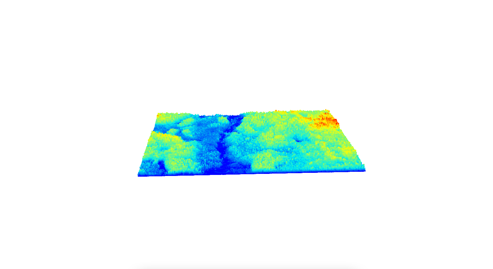

```{r setup, echo=FALSE, message=FALSE,warning=FALSE, error=FALSE}
library(lidR)
library(mapview)
library(rgl)
library(pandocfilters)
library(rmarkdown)
library(formatR)
library(gitignore)
library(tinytex)
library(knitr)
library(raster)
library(webdriver)
library(webshot)
library(webshot2)
library(terra)
library(matlab)
#webshot::install_phantomjs(force = TRUE)
knit_hooks$set(webgl = hook_webgl)
knit_hooks$set(rgl.static = hook_rgl)
knitr::opts_chunk$set(echo = TRUE, warning=FALSE, error=FALSE, message = FALSE)
set.seed(23)
```

## Action {.unnumbered}

This following report includes R Markdown documentation of processing steps taken to derive LiDAR-derived landscape and forest structure metrics from a continuous point cloud using the lidR package. All script files, package lists, markdown outputs, and virtual environment settings were stored in the github repository [13_lidR_PointCloud_Processing](https://github.com/seamusrobertmurphy/13_lidR_PointCloud_Processing.git).

# Import LiDAR

LiDAR downloads for the Ahbau region were imported as zip files and unpacked from their top-directory and subdirectory folders using the unzip function. I could not find any published R packages that deal with .7z archive files. Instead custom-written function was adopted from the RAMP project. This was done with the following code chunk:

```{r, echo=TRUE, eval=FALSE}
zip_file_ahbau = ("./14_LiDR-Processing_GitRepo/Data/Ahbau.zip")
zip_dir_ahbau_top = ("./14_LiDR-Processing_GitRepo/Data/")
unzip(zip_file_ahbau, 
      exdir = zip_dir_ahbau_top, 
      overwrite = TRUE)
zip_dir_ahbau_sub = ("./14_LiDR-Processing_GitRepo/Data/Ahbau/Las_v12_ASPRS")
zip_file_ahbau_sub = list.files(
  zip_dir_ahbau_sub,
  full.names = T,
  recursive = F,
  pattern = '.7z$')
 Write RAMP function and extract
un7zip = function(archive, where) {
  archive <- normalizePath(archive)
  current_path <- setwd(where)
  system(paste("7zr x", archive, sep = " "))
  setwd(current_path) }
un7zip(zip_file_ahbau_sub, zip_dir_ahbau_top)
```

# Read, Validate, and Assemble LiDAR Collection

LiDAR data for the Ahbau region included 311 tiles. These were assembled and processed as a LAS collection object using the LAScatalog engine. Initial validation procedures flagged potential overlapping areas. Potential duplicates were removed and as per PI recommendations the catalog was reformatted to 1km chunk sizing and 10m chunk buffering.

```{r, eval=TRUE}
las_ctg_ahbau = readALSLAScatalog("./Data/Ahbau/Las_v12_ASPRS/", select = "xyzcr",)
plot(las_ctg_ahbau)
#las_check(las_ctg_ahbau)
```

To avoid edge artifacts, buffering was left at 10m and the '-drop_class 19' filter was applied. See LAS point classifications noting overlapping flags [here](https://desktop.arcgis.com/en/arcmap/latest/manage-data/las-dataset/lidar-point-classification.htm#ESRI_SECTION1_FDEB62EB5C2B463F86507C3EE0A7F441).

```{r, eval=FALSE}
las_ctg_ahbau_indexed = readALSLAScatalog("./Data/Ahbau/Las_v12_ASPRS/")
opt_output_files(las_ctg_ahbau_indexed) = paste0(tempdir(), "./Data/las_ctg_ahbau_indexed")
opt_select(las_ctg_ahbau_indexed) = "xyzcr"
opt_filter(las_ctg_ahbau_indexed) = '-drop_class 19' 
opt_chunk_size(las_ctg_ahbau_indexed) = 1000 
opt_chunk_buffer(las_ctg_ahbau_indexed) = 10
filter_duplicates(las_ctg_ahbau_indexed)
is.indexed(las_ctg_ahbau_indexed)
#las_check(las_ctg_ahbau_indexed)
plot(las_ctg_ahbau_indexed, chunk = TRUE)
```

```{r, eval=TRUE, echo=FALSE, rgl.static=TRUE}
las_ctg_ahbau_indexed = readALSLAScatalog("./Data/Ahbau/Las_v12_ASPRS/")
opt_output_files(las_ctg_ahbau_indexed) = paste0(tempdir(), "./Data/las_ctg_ahbau_indexed")
opt_select(las_ctg_ahbau_indexed) = "xyzcr"
opt_filter(las_ctg_ahbau_indexed) = '-drop_class 19' 
opt_chunk_size(las_ctg_ahbau_indexed) = 1000 
opt_chunk_buffer(las_ctg_ahbau_indexed) = 10
is.indexed(las_ctg_ahbau_indexed)
#las_check(las_ctg_ahbau_indexed)
plot(las_ctg_ahbau_indexed, chunk = TRUE)

# deprecated functions
#opt_chunk_buffer(las_ctg_ahbau) = 10
#opt_chunk_size(las_ctg_ahbau) = 1000
#opt_select(las_ctg_ahbau) = "xyzr"
#opt_filter("-drop_overlap")
#index(las_ctg_ahbau) = 
#las_ctg_ahbau = lidR:::catalog_laxindex(las_ctg_ahbau)
#las_ctg_ahbau_indexed = readALSLAScatalog("./Data/las_ctg_ahbau_indexed")

# Retiling pipeline
#opt_output_files(las_ctg_ahbau_indexed) <- paste0(tempdir(), "./Data/las_ctg_ahbau_retiled")
#opt_chunk_buffer(las_ctg_ahbau_indexed) = 0
#opt_chunk_size(las_ctg_ahbau_indexed) = 1000
#las_ctg_ahbau_retiled = catalog_retile(las_ctg_ahbau_indexed)
#crs(las_ctg_ahbau_indexed) = 3005
#plot(las_ctg_ahbau_retiled, chunk = TRUE)
```


For visualization purposes, a single las tile '093g030122ne" was loaded, processed and plotted. All subsequent illustrations of processing operations were rendered using this tile chunk.

```{r, echo=TRUE, eval=FALSE, cache=TRUE}
las_tile_ahbau = readLAS("./Data/Ahbau/Las_v12_ASPRS/093g030122ne.las", select = 'xyzcr', filter = '-drop_class 19')
plot(las_tile_ahbau, bg = "white")
```


# Classification of Ground Points

Classification of ground points was implemented twice comparing system running time and data voids between the 'csf()' Cloth Simulation Filter algorithm [\@zhang2016] and the 'pmf()' Progressive Morphological Filter algorithm [\@zhang2003].

The Cloth Simulation Filter algorithm was fitted with the sloop_smooth tuning over a cloth resolution of 10cm and with a rigidness factor of 1.

```{r, eval=FALSE}
library(RCSF)
opt_output_files(las_ctg_ahbau_indexed) =  paste0(tempdir(), "./Data/las_ctg_ahbau_csf")
las_ctg_ahbau_csf = classify_ground(las_ctg_ahbau_indexed, csf(sloop_smooth=TRUE, 0.5, 1))
las_tile_ahbau_csf = classify_ground(las_tile_ahbau, csf(sloop_smooth=TRUE, 0.5, 1))
plot(las_tile_ahbau_csf, color = "Classification", bg = "white") 
```


The Progressive Morphological Filter algorithm was tuned using the 'util_makeZhangParam()' method, which generated a list of candidate parameters for testing window size and threshold. This internal function simply provides a sequence of parameters that match those in the original paper [\@zhang2003].

```{r, eval=FALSE}
opt_output_files(las_ctg_ahbau_indexed) =  paste0(tempdir(), "./Data/las_ctg_ahbau_pmf")
util_makeZhangParam()
las_ctg_ahbau_pmf = classify_ground(las_ctg_ahbau_indexed, pmf(seq(5, 9, 13), seq(3, 3, 3)))
las_tile_ahbau_pmf = classify_ground(las_tile_ahbau, pmf(seq(5, 9, 13), seq(3, 3, 3)))
plot(las_tile_ahbau_pmf, color = "Classification", bg = "white") 
```


# Classification and Removal of Noise

Classification of photon noise was applied using the 'sor' Statistical Outlier Removal' algorithm. This was fitted with default neighbourhood sample and multiplier of k=10 and m=3. Four possible methods for noise screening were found: 1) classification with internal algorithms and filtering with 'filter_poi' function and 'LASNOISE' string, 2) or filtering using the LAS classification codes with 'opt_filter' tool and '-drop class 19' string, 3) screening by threshold such as 'Z \> 40 & Z \< 0', 4) or screening by 95th percentiles. Seems a significant topic in forestry so leave this to your better judgement. The first approach seemed slower in the long run due to loss spatial indexing after assigning new catalog object to operate the filter_poi function, as seen below.

```{r, eval=FALSE}
opt_output_files(las_ctg_ahbau_csf) = paste0(tempdir(), "./Data/las_ctg_ahbau_csf_so")
opt_select(las_ctg_ahbau_csf) = "xyzcr"
opt_filter(las_ctg_ahbau_csf) = "-drop_class 19"
opt_chunk_size(las_ctg_ahbau_csf) = 1000
opt_chunk_buffer(las_ctg_ahbau_csf) = 10
sensor(las_ctg_ahbau_csf) = "als"
index(las_ctg_ahbau_csf) = "quadtree"

las_ctg_ahbau_csf_so = classify_noise(las_ctg_ahbau_csf, sor(k=10, m=3))
opt_output_files(las_ctg_ahbau_csf_so) = paste0(tempdir(), "./Data/las_ctg_ahbau_csf_sor")
las_ctg_ahbau_csf_sor = filter_poi(las_ctg_ahbau_csf_so, Classification != LASNOISE)

las_tile_ahbau_csf_so = classify_noise(las_tile_ahbau_csf, sor(k=10, m=3))
las_tile_ahbau_pmf_so = classify_noise(las_tile_ahbau_pmf, sor(k=10, m=3))
plot(las_tile_ahbau_csf_so, color = "Classification", bg = "white") 
plot(las_tile_ahbau_pmf_so, color = "Classification", bg = "white") 
las_tile_ahbau_csf_sor = filter_poi(las_tile_ahbau_csf_so, Classification != LASNOISE)
las_tile_ahbau_pmf_sor = filter_poi(las_tile_ahbau_pmf_so, Classification != LASNOISE)
```


# Digital Terrain Model

A digital terrain model was derived from a continuous, cleaned point cloud by applying the 'Inverse Distance Weighting' algorithm [\@tu2020]. The LAScataolog was read in again for faster processing by selectingfilter as is common practic in forestry analysis. As per PI's guidance, the Inverse Distance Weighting algorithm was chosen for its improved running time and its sensitivity to lake anomalies. This was implemented twice using the sample tile to compare visually between those derived from 'CSF' and 'PMF' processing. Parameters were set to default maximum radius of 50m, neighbourhood of 10 and inverse distance weighting power of 2, with a resolution of 1m.

```{r, eval=FALSE}
las_tile_ahbau_csf_sor_dtm = grid_terrain(las_tile_ahbau_csf_sor, 1, knnidw(10, 2, 50))
las_tile_ahbau_pmf_sor_dtm = grid_terrain(las_tile_ahbau_pmf_sor, 1, knnidw(10, 2, 50))
las_tile_ahbau_csf_sor_dtm_plot = plot_dtm3d(las_tile_ahbau_csf_sor_dtm, bg = "white") 
las_tile_ahbau_pmf_sor_dtm_plot = plot_dtm3d(las_tile_ahbau_pmf_sor_dtm, bg = "white") 
```


Visually, the cloth simulation filter produced better DEM result than the pmf that appears grainy. Rousseau (2021: 3.2) mentioned that the progressive morphological filter is an originally raster-based algorithm, while 'csf' may perform better with lidR operations that are point-orientated. The former was chosen to derive below a DEM raster for the Ahbau catalog. TODO: run individual las_check on two chunks showing warnings in processing image report of 'grid_terrain...knnidw()' operation bottom image:

```{r, eval=FALSE, rgl.static=TRUE}
opt_output_files(las_ctg_ahbau_csf_sor) = paste0(tempdir(), "./Data/las_ctg_ahbau_dtm")
opt_select(las_ctg_ahbau_csf_sor) = "xyzcr"
opt_filter(las_ctg_ahbau_csf_sor) = '-drop_class 19' 
opt_chunk_size(las_ctg_ahbau_csf_sor) = 1000 
opt_chunk_buffer(las_ctg_ahbau_csf_sor) = 10
sensor(las_ctg_ahbau_csf_sor) = 'als'
index(las_ctg_ahbau_csf_sor) = "quadtree"
las_ctg_ahbau_csf_dtm = grid_terrain(las_ctg_ahbau, 1, knnidw())
#opt_stop_early(las_ctg_ahbau_csf) <- FALSE #to skip voids
#las_ctg_ahbau_csf_dtm = grid_terrain(las_ctg_ahbau, 1, tin())
las_ctg_ahbau_csf_sor_dtm_crop = crop(
  las_ctg_ahbau_csf_dtm, extent(las_ctg_ahbau_csf_dtm) - 10)
crs(las_ctg_ahbau_csf_sor_dtm_crop) = 3005
las_ctg_ahbau_csf_sor_dtm_slope = terra::terrain(
  las_ctg_ahbau_csf_sor_dtm_crop, "slope", unit = "radians")
las_ctg_ahbau_csf_sor_dtm_aspect = terra::terrain(
  las_ctg_ahbau_csf_sor_dtm_crop, "aspect", unit = "radians")
las_ctg_ahbau_csf_sor_dtm_shade = hillShade(
  las_ctg_ahbau_csf_sor_dtm_slope, las_ctg_ahbau_csf_sor_dtm_aspect, 40, 270)
plot(las_ctg_ahbau_csf_sor_dtm_shade, col=grey(0:100/100), legend=FALSE)
```


# Height Normalization of Point Cloud

```{r, eval=FALSE}
opt_output_files(las_ctg_ahbau_csf_sor) =  paste0(tempdir(), "./Data/las_ctg_ahbau_norm")
opt_select(las_ctg_ahbau_csf_sor) = "xyzr"
opt_filter(las_ctg_ahbau_csf_sor) = '-keep_first' 
opt_chunk_size(las_ctg_ahbau_csf_sor) = 1000 
opt_chunk_buffer(las_ctg_ahbau_csf_sor) = 10
sensor(las_ctg_ahbau_csf_sor) = 'als'
index(las_ctg_ahbau_csf_sor) = "quadtree"

las_ctg_ahbau_csf_sor_norm = normalize_height(las_ctg_ahbau_csf_sor, knnidw())
las_tile_ahbau_csf_sor_norm = normalize_height(las_tile_ahbau_csf_sor, knnidw())
hist(filter_ground(las_tile_ahbau_csf_sor_norm)$Z, 
     breaks = seq(-0.6, 0.6, 0.01), main = "", xlab = "Elevation")
plot(las_tile_ahbau_csf_sor_norm, bg = "white")
```




# Area-Based Canopy Height Model

```{r, eval=FALSE}
opt_selopt_output_files(las_ctg_ahbau_csf_sor_norm) = paste0(tempdir(), "./Data/las_ctg_ahbau_dtm")
opt_select(las_ctg_ahbau_csf_sor_norm) = "xyzr"
opt_filter(las_ctg_ahbau_csf_sor_norm) = '-keep_first' 
opt_chunk_size(las_ctg_ahbau_csf_sor_norm) = 1000 
opt_chunk_buffer(las_ctg_ahbau_csf_sor_norm) = 10
sensor(las_ctg_ahbau_csf_sor_norm) = 'als'
index(las_ctg_ahbau_csf_sor_norm) = "auto"

las_ctg_ahbau_chm = grid_canopy(las_ctg_ahbau_csf_sor_norm, 1, dsmtin(8))
las_tile_ahbau_chm = grid_canopy(las_tile_ahbau_csf_sor_norm, 1, dsmtin(8))
plot(las_tile_ahbau_chm, col = height.colors(50))
```


# Individual Tree Metrics & Canopy Height Model

```{r, eval=FALSE}

las_tile_ahbau_csf_sor_norm_ttops = find_trees(las_tile_ahbau_csf_sor_norm, lmf(4), uniqueness = "bitmerge")
algo = dalponte2016(las_tile_ahbau_chm, las_tile_ahbau_csf_sor_norm_ttops)
las_tile_ahbau_csf_sor_norm_ttops_segmented = segment_trees(las_tile_ahbau_csf_sor_norm, algo)


#filter_poi(las_tile_ahbau_csf_sor_norm, Z < 0 & Z >= 0.15)
myMetrics = tree_metrics(las_tile_ahbau_csf_sor_norm, ~list(
    zmean   = mean(z),
    zmax    = max(z),
    q01     = quantile(z, probs = c(0.01)),     # 1st percentile value for cell
    q05     = quantile(z, probs = c(0.05)),     # 5th percentile value for cell
    q10     = quantile(z, probs = c(0.1)),      # 10th percentile value for cell
    q20     = quantile(z, probs = c(0.2)),      # 20th percentile value for cell
    q30     = quantile(z, probs = c(0.3)),      # 30th percentile value for cell
    q40     = quantile(z, probs = c(0.4)),      # 40th percentile value for cell
    q50     = quantile(z, probs = c(0.5)),      # 50th percentile value for cell
    q60     = quantile(z, probs = c(0.6)),      # 60th percentile value for cell
    q70     = quantile(z, probs = c(0.7)),      # 70th percentile value for cell
    q75     = quantile(z, probs = c(0.75)),     # 75th percentile value for cell
    q80     = quantile(z, probs = c(0.8)),      # 80th percentile value for cell
    q90     = quantile(z, probs = c(0.9)),      # 90th percentile value for cell
    q95     = quantile(z, probs = c(0.95)),     # 95th percentile value for cell
    q99     = quantile(z, probs = c(0.99)))     # 99th percentile value for cell
  


myMetrics_htop_plot = plot(myMetrics$q95)

metrics = tree_metrics(las_tile_ahbau_csf_sor_norm_ttops_segmented, ~list(z_max = max(Z), z_mean = mean(Z)))
metrics_htop = filter_poi(las_tile_ahbau_csf_sor_norm_ttops_segmented, treeID, %in%, metrics$z_mean=>95))
metrics_htop = tree_metrics(las_tile_ahbau_csf_sor_norm,quantile(z, probs = c(0.95))
plot(metrics_htop)
```


